# 《罗刹当铺》游戏设计策划书

> 一句话定位：一家开在罗刹海市的志怪当铺。玩家以情绪为本钱，在 90-150 秒内走完一局命数交易。

---

## 目录

1. [设计初衷](#1-设计初衷)
2. [核心理念](#2-核心理念)
3. [世界观设定](#3-世界观设定)
4. [玩法分层设计](#4-玩法分层设计)
5. [资源与数值体系](#5-资源与数值体系)
6. [内容体系](#6-内容体系)
7. [视觉与交互设计](#7-视觉与交互设计)
8. [v2 后续设计](#8-v2-后续设计)
9. [体验流程图](#9-体验流程图)
10. [附录](#附录)

---

## 1. 设计初衷

### 1.1 项目缘起

本作品最初为一道 AI Coding 比赛题的应答。题目要求：做一个"市场"，能买能卖、合法合规、不能纯展示、最好免注册 2 分钟可体验。

题面看似简单，但隐含约束严苛：

- 评委注意力极度稀缺，30 秒判生死、90 秒决名次
- "鼓励创新"是显性评分项，常见品类（电商、二手、拍卖）天然减分
- LLM 必须是产品引擎而非装饰
- 可分享性是隐藏分

题目背后的真问题不是"做一个能买卖的网页"，而是：

> 用 LLM 做一个 30 秒抓人、2 分钟跑完闭环、值得截图的"市场"，且这个"市场"不能让人一秒想起淘宝、闲鱼、eBay。

《罗刹当铺》是对这一真问题的回应。

### 1.2 设计目标

按优先级排：

| 优先级 | 目标 |
|--------|------|
| P0 | 30 秒内被氛围抓住、2 分钟内完整体验、第一时间想截图 |
| P1 | 作品具有自传播属性，玩家自发分享 |
| P2 | 24 小时内由单人 + AI 协作可交付 |
| P3 | 合规无瑕疵，文化引用得当 |

### 1.3 设计边界（不做什么）

明确不做的事：

- 不做注册账号系统（违反"无需注册"硬约束）
- 不做经济闭环（无平台货币、无虚拟资产 IAP）
- 不做留存 KPI（朋友圈小游戏，不是成品游戏）
- 不做多语言版本（v1 仅中文）
- 不做移动端原生应用（仅 H5 响应式）

**核心定位句**：朋友圈小游戏，不是成品游戏。

此句作为决策准绳，每次设计决策必须复诵一遍。任何会破坏此定位的功能扩展，自动出局。

---

## 2. 核心理念

### 2.1 价值倒错：罗刹海市的隐喻内核

蒲松龄《聊斋志异·罗刹海市》中，大罗刹国的核心特征是**价值秩序与中土相反**。原文中罗刹国"以异貌、怪貌为贵"，丑陋者位列三公，俊美者反被视为妖怪。

本作品借此母题，构造一个**价值倒错的市场**：

- 人间值钱的（金银），在罗刹当铺一文不值
- 人间一文不值的（情绪、念头、回忆），在罗刹当铺是硬通货
- 人间最稀缺的（一夜回到从前），在罗刹当铺只售九两九钱

价值倒错不仅是题材选择，更是**机制底色**——它解释了为什么本作品的"市场"不像淘宝。

### 2.2 你以为在交易，其实在漏

兑换损耗 30% 是本作品的核心规则之一。

数学上：1 两入柜，7 钱出门，固定损耗 3 钱（30%）。
文学上：每一次交易都让玩家的总资源缩水。

**这条规则把"交易"重新定义了**：

- 普通市场的交易是双赢（双方都得到自己想要的）
- 罗刹当铺的交易是双输（玩家在漏，掌柜也不积累）

**核心命题**：

> 你以为在交易，其实在漏。

这条命题不仅解释机制，也提供世界观——罗刹海市是一个所有交易都伴随损耗的地方，意味着任何"想要更多"的本身就是损耗。

### 2.3 命定与选择：开局已定，过程在你

每个玩家进店时，五项命数随机分配，但**总和恒等于九两九钱**。

设计含义：

- 总量恒定 = 命定（你出生时本是圆满的）
- 分布随机 = 命定的差异（有人痴重，有人慧重）
- 交易自由 = 选择（你可以放下，可以入世，可以空手离开）
- 损耗机制 = 代价（你做的每个选择都有不可逆的损失）

**这一组关系构成本作品的精神底色**：

> 人生不是公平的（命定）。
> 但你有选择（过程）。
> 选择是有代价的（损耗）。
> 但仍然要选择（无可避免）。

### 2.4 商品 vs 资源：两层抽象

本作品有两类"东西"：

**资源（Resource）**：玩家身上的五项命数，抽象的、用数值表示的、可量化的。
**商品（Item）**：当铺货架上的物件，具象的、用故事表示的、有名字有副作用的。

两层关系：

```
玩家用资源（数值）买商品（故事）
玩家把命名后的产物（故事）当商品卖给当铺，换资源（数值）
```

这个二分结构破解了一个设计陷阱——"梦想、勇气、回忆"这些概念应该放在哪里？答案是：它们不是新的资源维度，而是商品。

将"愿望、梦想、美好"作为商品而非资源，让游戏的内容空间几乎无限——商品可以是任何具象的、有故事的、可以用资源换取的东西。

---

## 3. 世界观设定

### 3.1 罗刹海市

一个不存在于地理之上的地方。它在某个雾夜的尽头，在你做错了选择的那一刻，在某句话说出口又咽回去的瞬间。

这里的法则与人间不同：

- 人间值钱的，在这里一文不值
- 人间一文不值的，在这里可能是镇店之宝
- 所有交易都伴随损耗
- 时间在这里只有夜晚

### 3.2 罗刹当铺

罗刹海市的中心，是这家当铺。

**铺规**：

- 不收金银
- 只收痴嗔贪惘
- 也卖那些已经失去、或还未得到的东西
- 一两入柜，七钱出门
- 必先典当，方可问价

### 3.3 掌柜

无名。年龄不可考。性别模糊。

**人格设定**：

- 自称"老朽"
- 称玩家"客官"
- 口吻：聊斋式半文不白 + 淡淡戏谑
- 永远不评判玩家的选择
- 不教育，不煽情，不主动给建议

**核心约束**：

掌柜是世界规则的化身，不是玩家的对手或朋友。他不参与价值判断，只完成交易。

### 3.4 进店者（玩家）

**身份**：进店者。

**初始资产**：九两九钱（五项命数随机分配，总和恒定）。

**可执行操作**：

- 摇签问命（开局必做）
- 入门典当（必做一次）
- 自由交易（可买可卖，2-3 笔）
- 再续一签（可选）
- 离店（任何时刻）

**核心权利**：进店者可以三笔之后什么都不换，空手离开。掌柜不会拦。

---

## 4. 玩法分层设计

游戏玩法分为五层，按时间顺序构成一局完整体验。

### 4.1 第一层：摇命定签（开局）

#### 设计目标

让玩家在 30 秒内进入世界、获得"画像"、产生分享冲动。

#### 流程

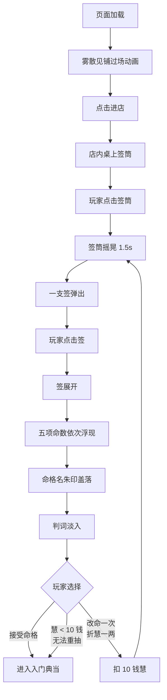

#### 命数生成算法

```
1. 在 [10, 89] 区间生成 4 个随机整数（单位：钱）
2. 加入 0 和 99，排序得 6 个数
3. 五项命数 = 相邻差值
4. 若任一项 < 10 钱（1 两），重抽
5. 五项总和恒等于 99 钱（9 两 9 钱）
6. 随机分配到 [痴, 嗔, 贪, 惘, 慧]
```

#### 命格名生成逻辑

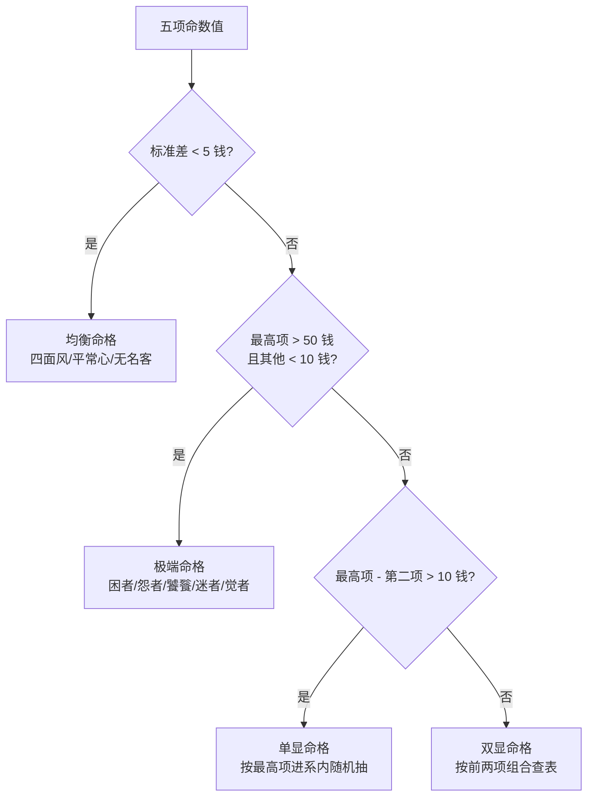

#### 核心交付物：命格卡

命格卡是第一张可分享卡片，包含：

- 命格名（毛笔字朱印样式）
- 五项命数完整数值
- 一句判词（10-25 字，半文白）
- 分享按钮（生成 PNG）

### 4.2 第二层：典当入门（必经）

#### 设计目标

通过强制典当建立游戏的核心循环节奏，并植入"付出先于收获"的精神底色。

#### 流程

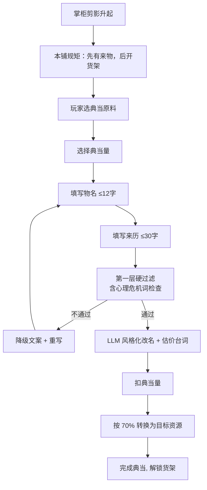

#### 典当量与转换效果

| 典当量 | 扣除（钱） | 兑换得（钱） |
|--------|-----------|-------------|
| 轻当 | 3 | 2 |
| 中当 | 7 | 5 |
| 重当 | 10 | 7 |

#### 转换默认规则

- 卖痴/嗔/贪/惘 → 默认得慧
- 卖慧 → 玩家自选目标项（痴/嗔/贪/惘其一）

#### LLM 在此层的职责

- 典当物风格化改名（"我对前任的恨" → "一壶陈年怨"）
- 估价台词文学化包装
- **不参与数值计算**

#### 关键设计点

入门典当不允许还价，掌柜直接定价：

> 此物随心，价由老朽定。

这一笔是玩家被规则碾压的第一次，建立整局的权力关系——掌柜不是和玩家做生意的人，是这个世界的规则本身。

### 4.3 第三层：货架交易（核心循环）

#### 设计目标

让玩家在 2-3 笔交易中体验"价值倒错"的完整循环：用情绪买故事、把故事当商品卖。

#### 流程

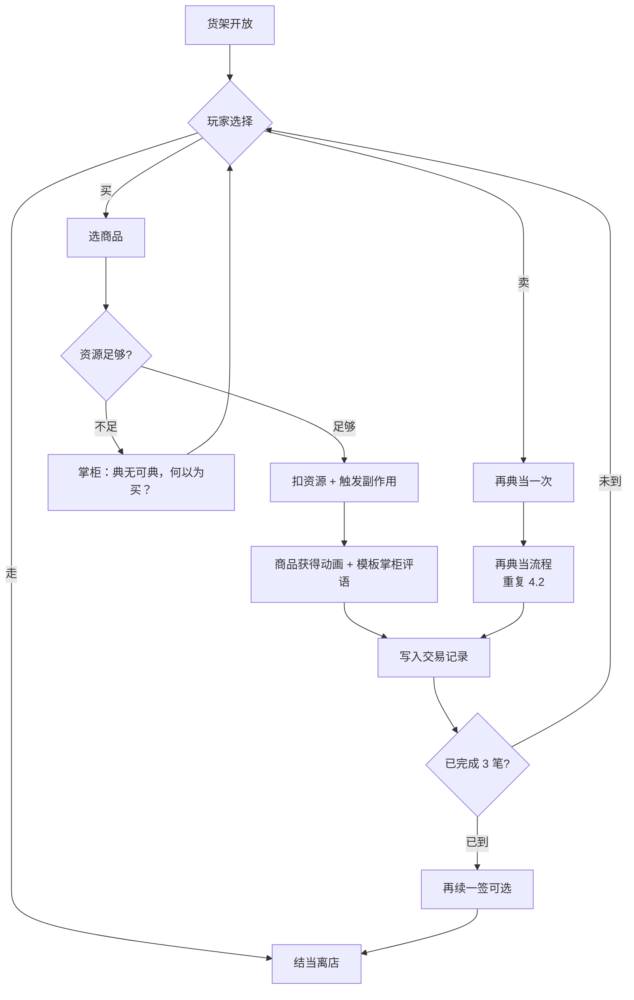

#### "卖 ≥ 买"约束的叙事化

后台规则：游戏全程"卖"次数 ≥ "买"次数。

前台表达：当玩家想买但典当次数不足时，按钮灰掉。点击时**不弹系统提示**，而是显示掌柜一句话：

> 典无可典，何以为买？

让规则成为叙事的一部分。

#### 商品价格与副作用结构

```typescript
type Item = {
  id: number;
  name: string;
  tier: 1 | 2 | 3 | 4 | 5 | 6 | 7 | 99;
  price: Partial<Record<ResourceKey, number>>; // 单位：钱，最多 2 项
  description: string;
  sideEffects: Partial<Record<ResourceKey, number>>;
  hiddenFlavor: string; // 购买后显示
  isLegendary?: boolean;
};
```

#### 单笔交易回合数

每笔交易 ≤ 2 个动作：选择 → 确认。不做开放式还价对话（v1 简化）。

### 4.4 第四层：再续一签（戏剧性）

#### 设计目标

为意犹未尽的玩家提供额外戏剧性，但不破坏整局节奏稳定。

#### 触发与机制

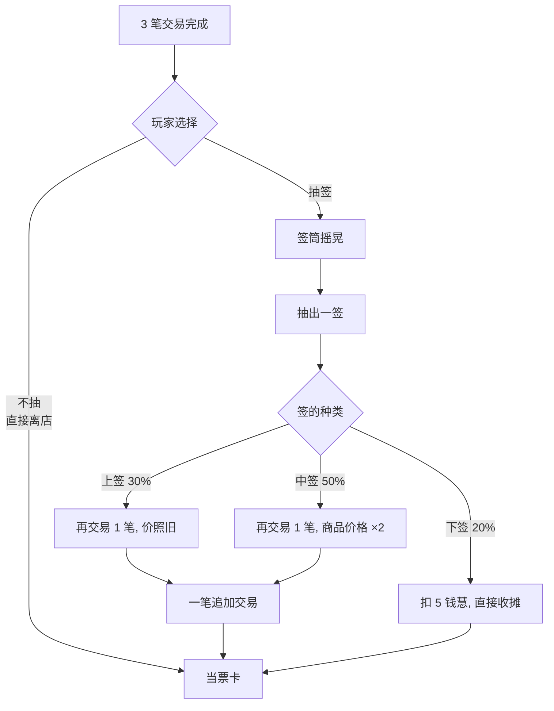

#### 设计要点

- **可选**：玩家可主动选择是否抽签。这一点保证 90-120 秒基础体验不被拖累
- **三种结果当场揭晓**：不可反悔
- **中签 ×2 仅作用于商品价格**：兑换损耗保持 30% 不变（避免规则套娃）

### 4.5 第五层：当票离店（收尾与传播）

#### 设计目标

提供第二张可分享卡片，完成传播闭环；用克制的收尾文字给玩家一个情绪出口。

#### 当票卡内容结构

| 区域 | 内容 |
|------|------|
| 顶部 | 命格名（朱印样式）+ "罗刹当铺"四字 |
| 中段 | 今夜关键交易记录（2-3 条） |
| 下段 | 命数变化对照（开局值 → 当前值） |
| 底部 | 掌柜临别赠言（LLM 生成，≤ 30 字） |
| 角落 | 古格式日期戳（"丙午年某月某夜"） |

#### 交易记录模板

```
以 [量][命数]，[动词][物件名/命数]
```

例：

- 以二两痴，换一份重逢
- 以一两慧，留下半生勇气
- 以三钱嗔，换七钱明白

LLM 仅生成动词（换/留/付/弃/赎/添等），其他字段由系统填充。

#### 临别赠言风格库（按交易路径选取）

| 路径 | 风格 | 例 |
|------|------|------|
| 卖业为主 | 释然 | "放下是福，客官慢走。" |
| 卖慧为主 | 警示 | "你今夜走得太深了。" |
| 均衡 | 平淡 | "来日再来。" |
| 极端清醒 | 决绝 | "此处已留你不住。" |
| 极端沉重 | 不语 | "灯下莫回头。" |
| 小而暖（20% 概率） | 余温 | "明日的你不必谢今夜的你。" |

#### 离店后空白页

分享操作完成 1.5 秒后，淡入一行小字：

> 明日还有明日的事。

---

## 5. 资源与数值体系

### 5.1 五项命数

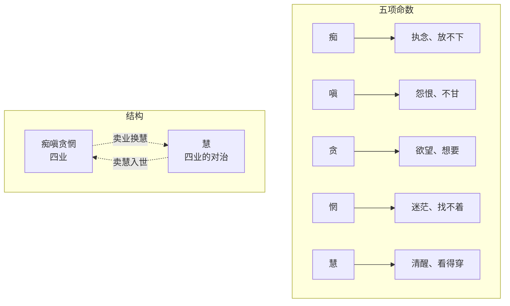

#### 命名声明（合规防护）

本作中"痴嗔贪"取其大众语义（如"痴情"、"不甘"、"贪心"），非严格佛教教义定义。"惘"为现代心理体验词，无佛学严肃对应。本设计不构成宗教教义解读。

#### 设计逻辑

四业 + 一慧的非对称结构：

- 正向兑换（卖业换慧）：放下、看穿
- 反向兑换（卖慧换业）：入世、再痴一次

两条路径都被游戏接受。**游戏不评判任何一种活法。**

### 5.2 单位制

**1 两 = 10 钱**。游戏全程只用此二级单位。

- 内部计算单位：钱（整数）
- 显示规则：≥ 10 钱转两+余钱、< 10 钱直显钱
- 单价范围：1 钱 - 9 两 9 钱（共 99 个价格点）

### 5.3 价格档位

| 档位 | 价格区间（钱） | 含义 | 库存 |
|------|--------------|------|------|
| 一档 | 1-5 | 玩物 | 4 件 |
| 二档 | 6-9 | 小物件 | 3 件 |
| 三档 | 10-19 | 普通货 | 4 件 |
| 四档 | 20-39 | 上品 | 4 件 |
| 五档 | 40-59 | 稀罕物 | 3 件 |
| 六档 | 60-79 | 奇货 | 3 件 |
| 七档 | 80-98 | 镇店之物 | 2 件 |
| 顶档 | 99（九两九钱） | 镇店幻物 | **1 件** |
| **总** | | | **24 件** |

#### 组合定价规则

- 单资源定价：如"七十钱痴"（即 7 两痴）
- 双资源定价：如"三十钱慧 + 二十钱痴"
- 禁止三资源以上组合
- 副资源占比 ≤ 总价 70%

#### 顶档商品的特殊设定

价格 99 钱（九两九钱），五项命数等比拆分：

```
痴 20 钱 + 嗔 20 钱 + 贪 20 钱 + 惘 20 钱 + 慧 19 钱
```

慧的占比最低，叙事意涵：要回到从前，最难放下的不是贪嗔痴，而是清醒。

**关键设计含义**：购买顶档商品需玩家所有 5 项命数都有足够余量。一旦玩家开始交易，必有损耗，几乎不可能五项都满足购买条件。

顶档商品**始终可见、始终可购买**（如条件满足），不实现"卖完消失"。它是叙事元素，不是稀缺道具。

### 5.4 兑换损耗

**统一规则：1 两换 7 钱（损 3 钱，约 30%）**

#### 适用场景

- 卖业换慧
- 卖慧换业
- v1 不开放业业互换

#### UI 文学化包装

```
一两入柜，七钱出门。
罗刹海市从不做足秤买卖。
```

掌柜在玩家完成第一次典当时说一次此句。后续不再重复。

#### 数值合理性

玩家初始 9 两 9 钱（99 钱），三笔典当（每笔 7-10 钱）累计扣除约 21-30 钱、获得约 14-21 钱。损耗约 7-9 钱（占初始 7-9%）。

这一缩水幅度肉眼可见但不破坏游戏感。

### 5.5 关键数学约束


**九两九钱的多重闭环**：

- 玩家初始命数总和 = 9 两 9 钱
- 镇店幻物价格 = 9 两 9 钱
- "九"为数之极的文化锚点
- 玩家需"五项俱全"才能买圆满 = 玩家需"未交易过"才有完整 9 两 9 钱
- 但游戏强制必须先典当，所以玩家进入店内后已不再完整

这条闭环是数学，也是文学。

### 5.6 资源边界规则

```typescript
// 边界保护
function clampResource(value: number): number {
  return Math.max(0, Math.min(99, value));
}

// 资源最低 0、最高 99
// 副作用导致负值时，钳制为 0
// 副作用导致超 99 时，钳制为 99
// 不实现"副作用触发商品消失"等复杂边界（v2 再考虑）
```

---

## 6. 内容体系

### 6.1 商品池（24 件）

#### 调子

- 七分聊斋骨 + 三分刀郎味
- 现代隐喻仅在副作用文案中偶尔点
- 一档二档专做荒诞幽默，冲淡整体悲观底色

#### 商品分档示例

**一档（玩物）**：

| 名 | 价格 | 副作用 | 隐藏文案 |
|----|------|--------|---------|
| 一枚无用铜钱 | 贪 2 钱 | 贪 +1 钱 | 买下后你会觉得自己很会过日子 |
| 半句硬话 | 嗔 3 钱 | 嗔 -1 钱，惘 +2 钱 | 用过的人都说，憋回去那半句最伤身 |
| 别人家的灯火 | 贪 4 钱 | 贪 +2 钱，惘 +1 钱 | 看着是温暖。可那不是你家 |
| 一阵假咳 | 嗔 2 钱 | 嗔 +1 钱 | 客官莫笑，铺子里这件最好卖 |

**四档（上品）**：

| 名 | 价格 | 副作用 | 隐藏文案 |
|----|------|--------|---------|
| 错过的回信 | 痴 30 钱 | 痴 -10 钱，慧 +5 钱 | 拆，或不拆，都可。掌柜不催 |
| 三声晚钟 | 慧 25 钱 + 痴 5 钱 | 嗔 -5 钱，惘 -3 钱 | 听过的人，半夜醒来不再翻身 |

**七档（镇店之物）**：

| 名 | 价格 | 副作用 |
|----|------|--------|
| 一句迟到的对不起 | 痴 50 钱 + 嗔 35 钱 | 痴 -25 钱，嗔 -15 钱，慧 +20 钱 |

**顶档（镇店幻物，全店仅 1 件）**：

| 名 | 价格 | 副作用 |
|----|------|--------|
| 一夜回到从前 | 痴 20 + 嗔 20 + 贪 20 + 惘 20 + 慧 19 钱 | 痴 +10，惘 +10，慧 -10 钱 |

商品文案：可回任一旧夜，不可改一字一句。
副作用文案：天明仍归此身。
购买后掌柜临别一句：此后，你便不再需要当铺了。天亮前记得回来。

#### 完整商品池

完整 24 件商品的全字段定义详见配套文件《罗刹当铺-内容地基-v1.0.md》。

### 6.2 命格名词典（60 项）

#### 五大类

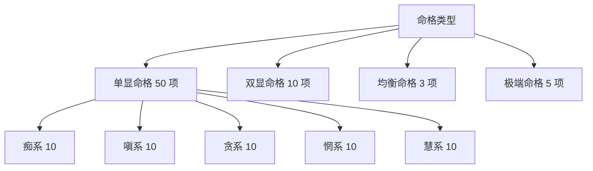

#### 单显命格示例

- **痴系**：执念客、长情人、不归客、痴上人、刻骨者、问月人、夜半客、心系客、停泊人、记忆者
- **嗔系**：不甘人、未平客、刺骨者、烈火心、积怨人、寒露客、咬牙人、断剑客、夜雨人、未渡者
- **贪系**：未足客、欲海人、未尽者、永饥客、求圆人、追光客、收藏家、未醒人、贪春客、慕远者
- **惘系**：迷途人、问路客、雾中人、不知客、四面风、寻光客、空舟人、过雾者、问津客、远行人
- **慧系**：素心客、明镜人、过来者、无挂客、知止人、看透客、清醒者、岸上人、止水客、解脱者

#### 双显命格示例

| 双显组合 | 命格名 |
|----------|--------|
| 痴 + 嗔 | 红尘骨 |
| 痴 + 贪 | 求而不得者 |
| 痴 + 惘 | 迷恋客 |
| 嗔 + 贪 | 刚烈客 |
| 嗔 + 惘 | 苦海人 |
| 贪 + 惘 | 浮生客 |
| 慧 + 痴 | 半渡人 |
| 慧 + 嗔 | 持剑者 |
| 慧 + 贪 | 知足客 |
| 慧 + 惘 | 观潮人 |

#### 判词风格

半文白短句，10-25 字。例：

- 痴上人："一生只为一事一人。"
- 四面风："样样都有，样样不深。最易过日子，最易茫然。"
- 素心客："心已澄明。但人间还想留你多坐一会。"

每个命格至少 2 句备选判词，LLM 调用失败时从此池随机取。

### 6.3 掌柜台词模板库

#### 模板库结构

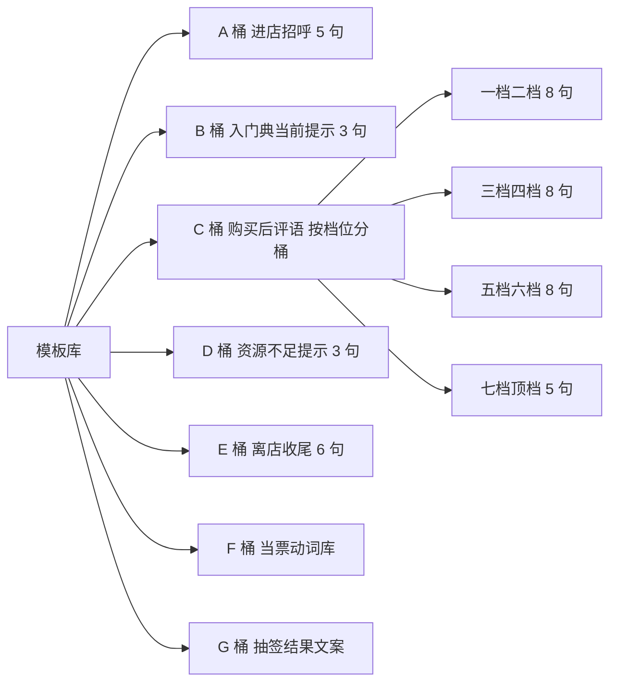

#### 设计原则

掌柜在游戏中的台词分两类：

- **LLM 实时生成**（仅 3 处）：命格判词、典当估价、当票评语
- **模板库取**（其余所有场景）：进店、典当提示、购买评语、资源不足提示、离店收尾

模板库总计 50+ 句变体，覆盖游戏全流程，确保 LLM 失败时主流程不受影响。

#### LLM 调用规划

| 调用 # | 时机 | 输入 | 输出 | Fallback |
|--------|------|------|------|----------|
| 1 | 命格抽取后 | 五项命数值 | 命格名 + 判词 | 词典查找 + 默认判词 |
| 2 | 入门典当提交后 | 命数项 + 典当量 + 名 + 来历 | 改名 + 估价台词 | 不改名 + 模板台词 |
| 3 | 离店生成当票时 | PlayerState 全部 | 临别赠言 + 动词填充 | 风格库选取 + 默认动词 |

**严格 3 次调用上限**。所有调用均有 fallback 兜底，主流程绝不因 API 失败而卡死。

---

## 7. 视觉与交互设计

### 7.1 整体视觉调性

#### 风格基调

- 风格：聊斋绣像本插画 + 清代版画 + 水墨写意 + 丰子恺笔触
- 倾向：半文半白，介于纯写实国画与现代插画之间
- 暗度：中暗（适合手机屏阅读，保持志怪沉郁感）

#### 配色系统

| 用途 | 色值 |
|------|------|
| 主背景（深褐墨色） | `#3a2818` |
| 次背景（暖棕） | `#6b4423` |
| 纸面色（泛黄宣纸） | `#d4b896` |
| 强调色（朱砂红） | `#8b1a1a` |
| 烛光暖色 | `#d4a574` |
| 文字主色（墨色） | `#3a2818` |
| 文字浅色（赭石） | `#a67c52` |

#### 字体系统

- **毛笔字标题**（罗刹当铺、命格名、商品名）：Ma Shan Zheng
- **古风正文**（掌柜台词、判词、商品描述）：ZCOOL XiaoWei
- **默认正文**：Noto Serif SC

#### 视觉禁区

- 不用任何赛博朋克元素
- 不用紫渐变、性冷淡风、科技蓝
- 不用现代游戏 UI 模板
- 不用 emoji
- 不用通用图标库的图（购物车、信封等）

### 7.2 五幕戏过渡

整局体验通过五幕戏推进，每一幕有明确的视觉过渡：

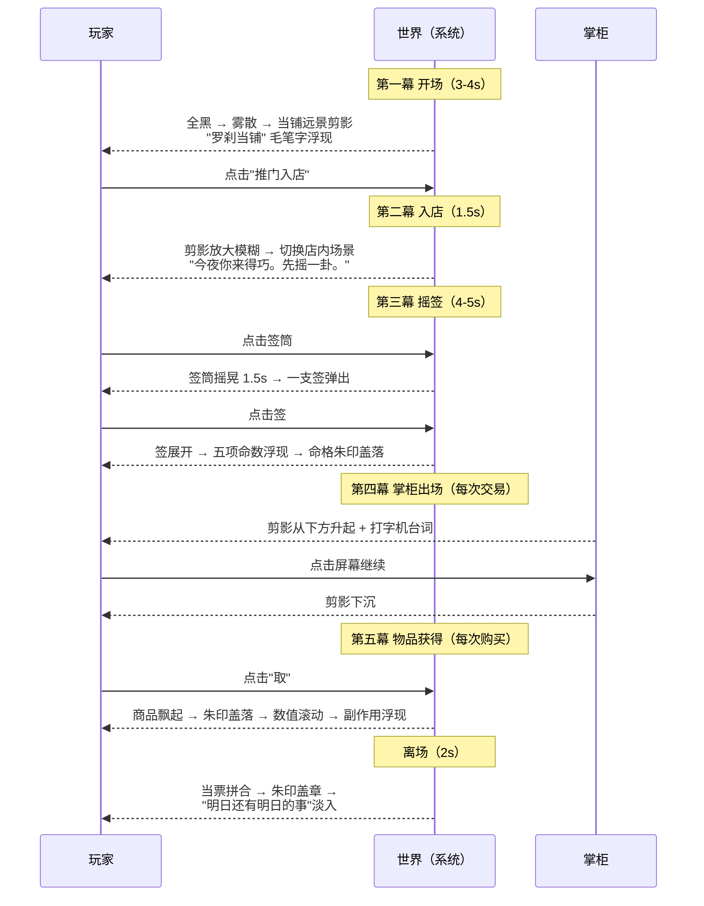

#### 关键交互细节

- **打字机效果**：每字 60-80ms，掌柜台词全部使用此效果
- **数值变化**：用 CountUp 滚动展示，不用直接跳变
- **朱印盖落**：scale 4 → 1 + rotate -20 → -2 + spring 200 stiffness
- **签筒摇晃**：rotate keyframes [-3, 3, -2, 2, -1, 1, 0] 持续 1.5s
- **跳过机制**：所有过渡动画支持点击屏幕跳过（避免拖累整局节奏）

### 7.3 双卡片传播设计

#### 设计意图

提供两次自然的截图机会，最大化传播频次。

#### 两张卡片对照

| 维度 | 命格卡（开局） | 当票卡（终局） |
|------|---------------|---------------|
| 时机 | 进店第一秒 | 离店最后一秒 |
| 内容 | 你是什么样的人 | 你做了什么 |
| 调性 | 命定、无可奈何 | 选择、有所交代 |
| 视觉 | 古签纸样式 | 当票样式 |
| 文字 | 一句判词 | 多笔交易记录 |
| 比例 | 3:4 竖版 | 3:4 竖版 |

#### 两张卡的精神对照

> 命格卡讲：人生开局已定。
> 当票卡讲：但过程在你。

两张卡放一起，构成本作品的全部精神。

---

## 8. v2 后续设计

> v1 是一个 24 小时交付的单机闭环 demo。
> v2 是这个世界真正长开的样子——
> 加入玩家共生、时间维度、真实交易，
> 但保持 v1 的精神内核与美学边界。

### 8.1 v2 设计原则

**原则一：v1 体验路径必须完整保留。**

新玩家进入 v2 仍然能在 90-120 秒内走完命格→典当→交易→当票，不被复杂度阻挡。所有 v2 新增内容均为"加菜"，不是"换菜"。

**原则二：互动门槛叙事化。**

不用"用户分级"、"VIP"、"成就解锁"等产品逻辑。所有门槛通过世界规则表达。例如新玩家只能见到预置商品，玩过一局后才能看到 UGC 货架——叙事上是"客官第一次来，先适应铺子里的物事"。

**原则三：所有真实 UGC 必须经过双层过滤 + 时间延迟。**

合规高于体验。详见 8.5。

### 8.2 真实 UGC 公共池

#### v1 vs v2 对比

| 维度 | v1 | v2 |
|------|------|------|
| 玩家典当物 | 仅本人本局可见 | 进入"延迟池"，24-48 小时后入公共货架 |
| 公共货架 | 24 件预置 | 预置 + UGC 混合，30:70 渐变 |
| "昨夜某客典当" | 模拟数据 | 真实 UGC（脱敏后） |

#### v2 UGC 完整流程

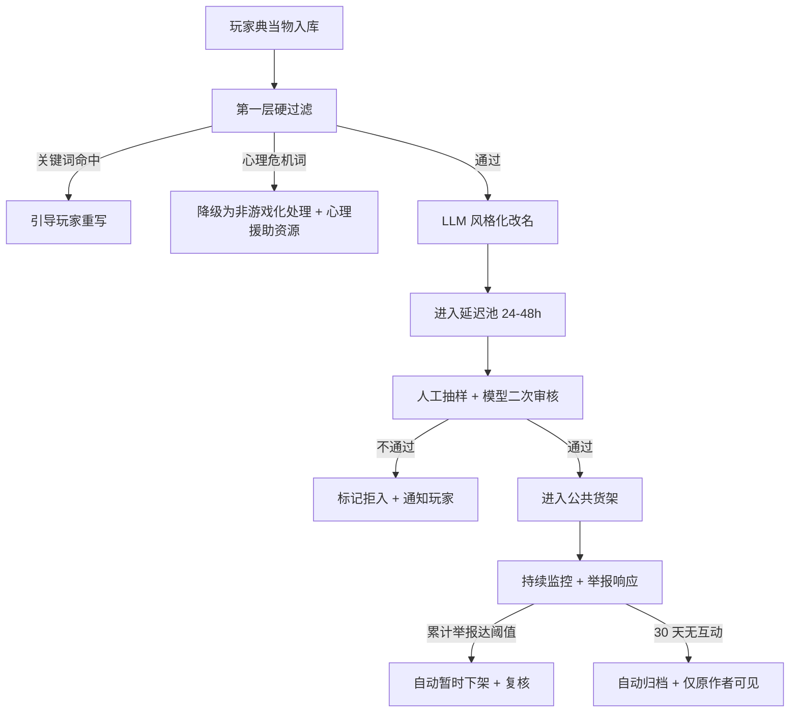

#### 关键设计点

- **延迟池的双重价值**：合规审核窗口 + 叙事中"昨夜的"历史感
- **心理危机内容硬隔离**：永远不进入游戏循环
- **持续监控**：UGC 上线后仍可被下架，不是"上线即永久"
- **自然生命周期**：30 天无互动归档，避免内容墓地堆积

### 8.3 玩家间互动机制

#### 不引入注册账号

v2 仍然保持"无需注册"硬约束。互动通过两种轻量身份实现：

- **默认匿名**：浏览器 fingerprint
- **可选署名**：扫码绑定微信仅用于"在物件上署名"（如"昨夜，某客典当此物"），不存任何个人信息

#### 核心机制 A：赎回

玩家典当过的物件留在罗刹当铺的"故纸堆"。下次进店时可选择赎回。

| 规则 | 设计 |
|------|------|
| 赎回价 | 原典当价 × 1.5 |
| 赎回时限 | 7 天 |
| 时限后 | 物件进入公共货架，任何玩家可购买 |
| 叙事意涵 | "你只是暂时把东西放在这里" |

#### 核心机制 B：转让

玩家可将自己典当过的物件**赠送**给另一位玩家。


#### 关键设计点

- 不是经济系统：无交易币、无标价、无平台抽成
- 链接只能用一次：一件物件被转让后，原玩家就再也见不到
- 转让是真正的"送出去"，不是"借给别人看"
- 无法让两个玩家"私下交易"实现套利

#### 核心机制 C：留言与回响

每件玩家典当的物件可附带一条留言（≤ 30 字），但**不立即显示**。当物件被另一位玩家购买时，留言作为隐藏文案展示。

##### 设计意图

一种异步的、单向的、单次的留言。不是社交，不是评论区，不是点赞系统。

##### 范例

> A 典当"对老家的思念"（"一抔他乡的月色"），附留言："写给所有不能回去的人"。
> 物件入公共货架。
> B 看到，购买。
> 购买完成后，B 看到这句留言。
> A 不知道 B 是谁。B 也不知道 A 是谁。
> 但有一句话从陌生人传到陌生人。

像古代当铺里，前任主人在物件背面刻一行字，被下一任主人偶然发现。

### 8.4 节气与时间维度

v1 是无时间感的世界。v2 引入"夜"和"节气"。

#### 时间机制：罗刹当铺只在夜里开门

- 营业时间：每日 18:00 - 次日 06:00
- 白天访问：画面是雾散后的白天店铺，门紧锁。下方一行字："今夜未到，客官请回。"

#### 节气商品（限时机制）

二十四节气，每个节气仅当天挂一件特殊商品。

##### 节气商品示例

| 节气 | 商品名 | 价格 | 副作用 |
|------|--------|------|--------|
| 清明 | 一封烧给故人的信 | 贪 3 两 + 痴 2 两 | 慧 +5 钱 |
| 冬至 | 一碗团圆饭 | 惘 4 两 | 痴 +1 两 |
| 七夕 | 一年没说出口的告白 | 嗔 5 两 | 痴 -1 两，慧 +5 钱 |

##### 关键设计点

- 不引入"紧迫感营销"：商品介绍里**不写**"仅剩 X 小时"
- 掌柜的提示极克制："今夜清明，铺子里有件物事。"
- 紧迫感由文化背景自然带出，不由营销话术制造

### 8.5 v2 合规升级

v2 在 v1 的基础上增加四层合规机制：

#### 1. UGC 持续审核

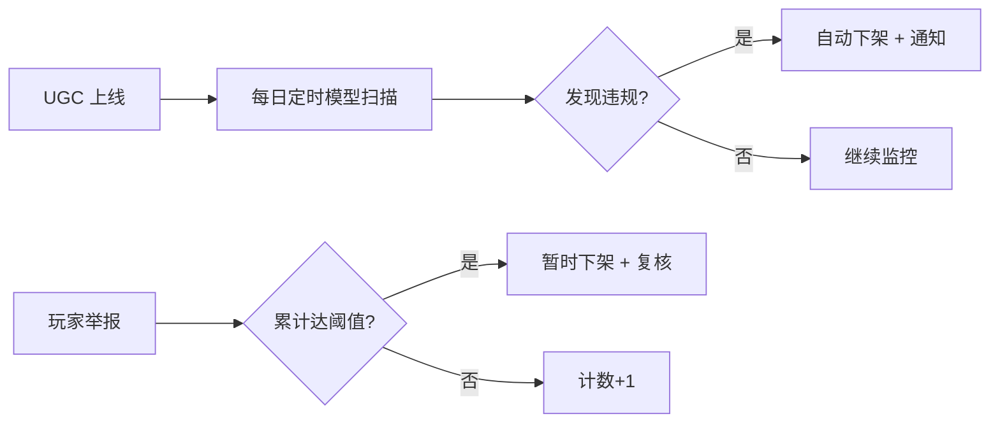

#### 2. 举报机制

每个 UGC 商品有不显眼的举报入口。任何玩家可一键举报。

#### 3. 老物件归档

超过 30 天无互动的 UGC 物件，自动从公共货架"归档"——不删除，仅原作者可见。这是自然内容生命周期管理。

#### 4. 心理援助合作机构

v2 上线前接入正式心理援助合作机构，在心理危机被检测到时直接转接合作咨询资源（不仅是显示热线电话）。

### 8.6 v2 不做的事

为保持作品本质，v2 仍然不做：

- 注册账号系统（最多 fingerprint + 可选署名）
- 真实货币交易（玩家间无法用钱买物件）
- 排行榜（破坏世界观，会变成竞争游戏）
- 朋友列表 / 关注 / 私信（破坏匿名性）
- 弹幕 / 评论区（同上）
- 等级系统 / 成就系统（破坏"每个进店者平等"的精神）
- 上 App Store / 小程序版（保持 H5 形态）

#### 核心边界

v2 不能让罗刹当铺变成另一个产品。它仍然是那家雾夜里的铺子，只是开门时间更长，故事更多。

### 8.7 v2 视觉与交互升级

#### 已规划升级项

| 项目 | v1 | v2 |
|------|------|------|
| 背景动效 | CSS 雾气 | Seedance 2.0 循环视频（首尾帧一致） |
| 背景音 | 无 | Suno 生成（木鱼、铃、低频 drone、五声音阶） |
| 掌柜剪影 | 单一姿态 | 多姿态切换（打量、估价、推签、临别） |
| 摇签效果 | 2D 摇晃 | Three.js 真 3D 物理签筒 |

### 8.8 v2 不做商业化

罗刹当铺定位为**长期 demo + IP 试验场**：

- 不上 App Store / 小程序
- 不做用户增长 / 留存指标
- 不做商业化（无广告、无付费内容、无虚拟货币）
- 不做 KPI / OKR

它就是一个雾夜里的铺子。开着，有人来，有人走。

---

## 9. 体验流程图

完整一局体验的状态流转：

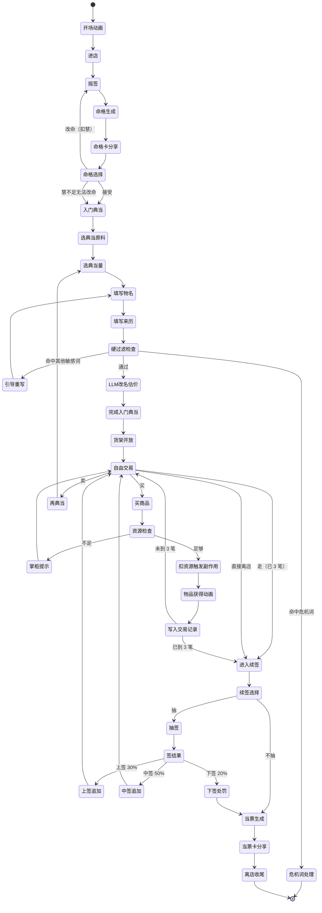

---

## 10. 附录

### 附录 A：游戏速览（一页纸）

| 项 | 内容 |
|----|------|
| 作品名 | 罗刹当铺 |
| 类型 | 文字交易 + 命格抽签 + 卡片分享 |
| 平台 | H5 网页（响应式） |
| 时长 | 90-150 秒/局 |
| 注册 | 无 |
| 主流程 | 摇签 → 入门典当 → 自由交易（≤3 笔） → 可选续签 → 当票 |
| 资源 | 痴 / 嗔 / 贪 / 惘 / 慧（共五项命数） |
| 货币单位 | 两 / 钱（1 两 = 10 钱） |
| 初始资产 | 9 两 9 钱（五项随机分配） |
| 兑换损耗 | 30%（一两换七钱） |
| 商品池 | 24 件 + 顶档 1 件传说 |
| 命格库 | 60 项（5 类） |
| 掌柜台词模板 | 50+ 句 |
| LLM 调用上限 | 3 次/局（全程 fallback 兜底） |
| 分享卡 | 命格卡（开局）+ 当票卡（终局） |

### 附录 B：核心算法摘要

#### B.1 命数生成

```typescript
function generateResources(): ResourceMap {
  while (true) {
    const cuts = [...Array(4)].map(() => Math.floor(Math.random() * 80) + 10).sort();
    const points = [0, ...cuts, 99];
    const values = points.slice(1).map((p, i) => p - points[i]);
    if (values.every(v => v >= 10)) {
      return shuffleAndAssign(values, ['chi', 'chen', 'tan', 'wang', 'hui']);
    }
  }
}
```

#### B.2 命格名生成逻辑

```typescript
function getFateName(r: ResourceMap): string {
  const values = Object.values(r);
  const sorted = [...values].sort((a, b) => b - a);
  const stdDev = calculateStdDev(values);

  if (stdDev < 5) return pickRandom(BALANCED_FATES);

  const max = sorted[0];
  const others = sorted.slice(1);
  if (max > 50 && Math.max(...others) < 10) {
    return getExtremeFate(r);
  }

  if (max - sorted[1] > 10) {
    return getSingleFate(r);
  } else {
    return getDoubleFate(r);
  }
}
```

#### B.3 兑换损耗计算

```typescript
function calculateExchange(amount: number): number {
  return Math.floor(amount * 0.7);
}
// 1 两(10 钱) → 7 钱
// 7 钱 → 4 钱
// 3 钱 → 2 钱
```

#### B.4 资源边界保护

```typescript
function clamp(value: number): number {
  return Math.max(0, Math.min(99, value));
}

function applySideEffects(
  current: ResourceMap,
  effects: Partial<ResourceMap>
): ResourceMap {
  const next = { ...current };
  for (const [key, delta] of Object.entries(effects)) {
    next[key as ResourceKey] = clamp(next[key as ResourceKey] + (delta ?? 0));
  }
  return next;
}
```

### 附录 C：术语表

| 术语 | 定义 |
|------|------|
| 命数 | 玩家身上五项可交易资源的统称（痴/嗔/贪/惘/慧） |
| 业 | 痴/嗔/贪/惘 四项的统称（v1 文档内称谓，v2 文档简化为"前四念"） |
| 入门典当 | 进入交易循环前的强制典当一次 |
| 兑换损耗 | 30% 的固定交易损耗，"一两入柜，七钱出门" |
| 命格 | 玩家五项命数的画像化命名（如"未平客"） |
| 命格卡 | 开局生成的可分享卡片 |
| 当票卡 | 终局生成的可分享卡片 |
| 镇店幻物 | 价格 9 两 9 钱的顶档商品，全店仅 1 件 |
| 模板库 | 掌柜台词的预置文本库，LLM 失败时的兜底 |
| 双卡片传播 | 一局两次截图机会的传播架构 |

---

**文档版本**：v1.0
**适用项目状态**：v1 已上线，v2 设计中
**项目地址**：[https://luocha-pawnshop.vercel.app](https://luocha-pawnshop.vercel.app)
**配套文档**：
- 《罗刹当铺-项目书-v1.1-比赛交付版.md》（开发文档）
- 《罗刹当铺-内容地基-v1.0.md》（内容资产）
- 《罗刹当铺-完整设计复盘.md》（创作过程长文）
